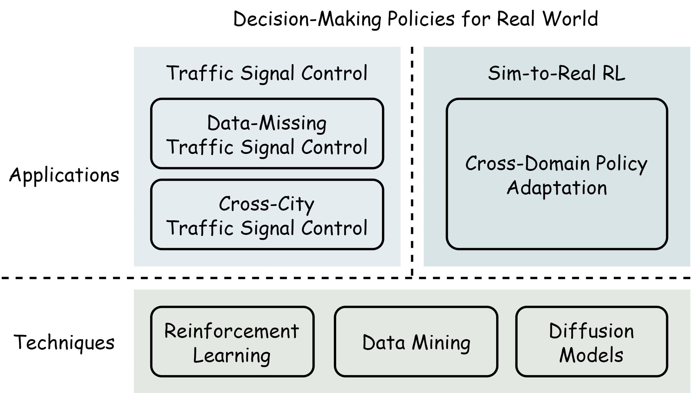

## About Me

I am a final-year Master's student at the School of Computer Science and Technology, Beijing Jiaotong University (BJTU), supervised by Prof. [Shengnan Guo](https://faculty.bjtu.edu.cn/9685/) and co-advised by Prof. [Huaiyu Wan](https://faculty.bjtu.edu.cn/8793/). I received my Bachelor's degree in Computer Science and Technology from Beijing Jiaotong University. My main research interests include reinforcement learning, data mining, diffusion models and large language models.

I am actively looking for a Ph.D. position in reinforcement learning, embodied AI or large language models starting in Fall 2026, appreciate any opportunities!

## Research

    

I have been working on decision-making policies for real world in two areas: traffic signal control (TSC) and sim-to-real reinforcement learning (RL). My research roadmap is shown above.

- **Data-missing traffic signal control with diffusion models (TSC)**
- **Cross-city traffic signal control by Shapley value enhanced multi-task RL (TSC)**
- **Cross-domain policy adaptation for sim-to-real tasks with diffusion models (RL)**

Towards more generalizable and robust policies, I am working with collaborators on senario generation for traffic simulation and exploring the utilization of foundation models (e.g., LLMs, VLMs and VLAs) in decision-making tasks.

<!-- I am still exploring my research interests in large language models, autonomous driving, and embodied AI. Glad to discuss with you if you are also interested in these topics! -->

## News

- **[Jun. 2025]** Our paper about proactive traffic signal control has been accepted by IEEE TMC. It is available now!
- **[Dec. 2024]** I have received the National Scholarship.
- **[Oct. 2024]** I have received the NeurIPS 2024 Scholar Award.
- **[Sep. 2024]** Our paper about traffic signal control in the data-missing scenario has been accepted by NeurIPS 2024. See you in Vancouver!







